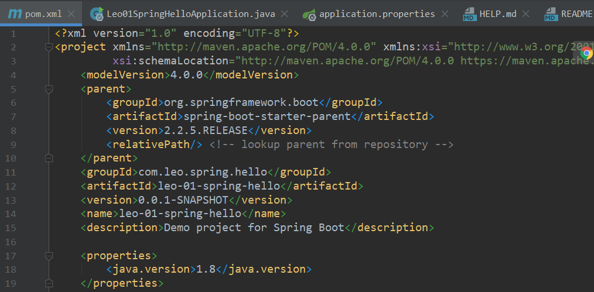
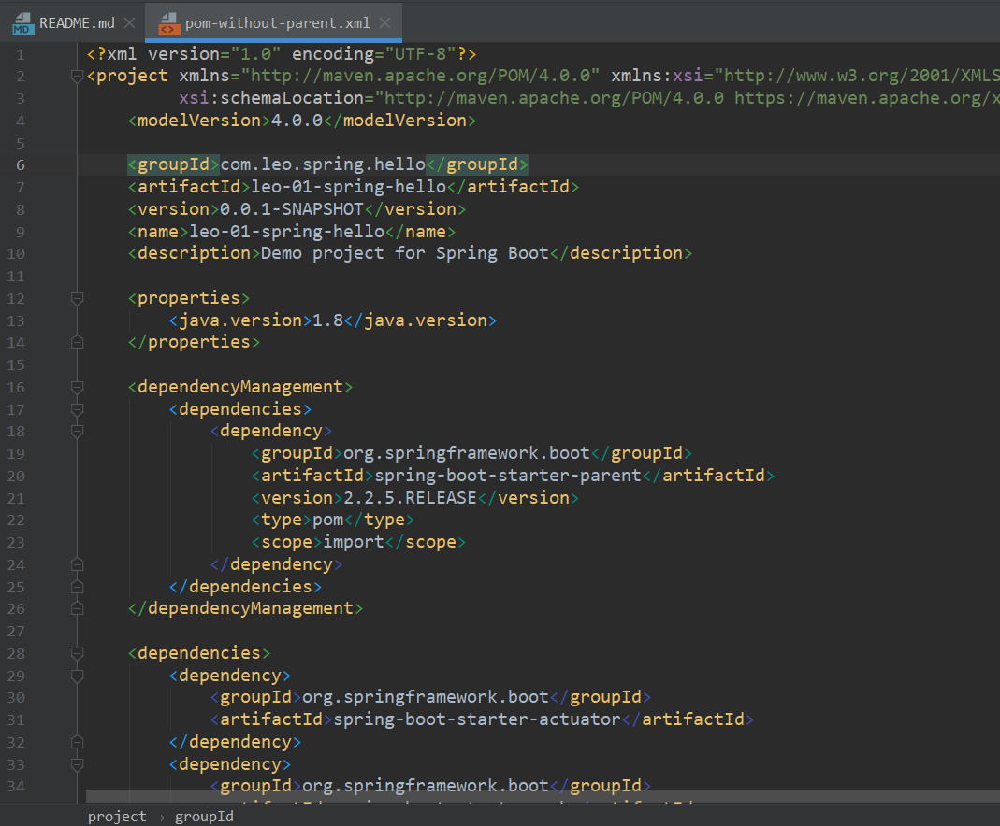

## spring全家桶系列
### 01 leo-spring-hello

引入jar：
* web 用于请求 
* actuator 监控
* test 测试

更改端口：因为被占用所以更改了端口号
* 在 application.properties 中添加`server.port=8090`

启动项目，可以在窗口Terminal中使用命令进行请求，命令如下：
`curl http://localhost:8090/hello`

使用 actuator 进行健康检查，命令为：
`curl http://localhost:8090/actuator/health`

剔除测试类，打jar包，命令如下：`mvn clean package -Dmaven.test.skip`  
打完jar包直接执行：`java -jar xxxx.xxx.jar`

pom中如不不想使用springframework作为parent，则可以改为如下形式：  
原：  
    
改：  
  

可以参考文件：`pom-without-parent.xml`
